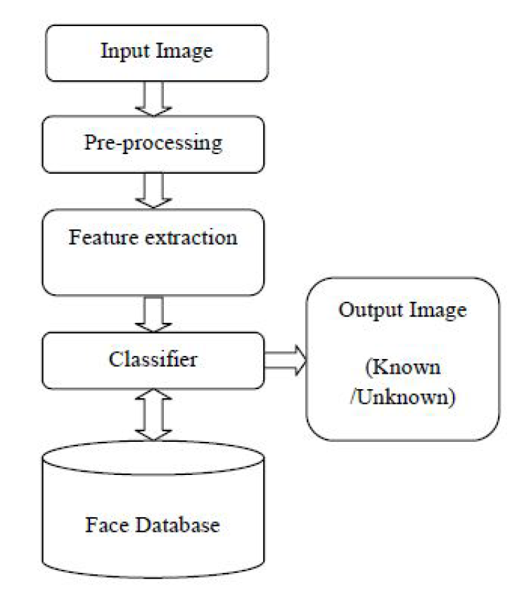

# Eigenfaces

## First push:
**facealigner:** 
  Contains a function that takes a picture and resizes, crops, rotates the picture with the face centered. Utilizes OpenCV and dLib  
  **dataImporting:** 
  Preprocess the data (fnames: indian_faces and data) and saves them to a new file 
 
## Goals:
  1. Preprocess data and put them in a file **(Done)** 
  1. Implement PCA and N-PCA - procedures for dimensionality reduction by identifing the most importantt features (eigenvalues) 
  1. Implement eigenfaces using both methods 
  1. Implement different classification algorithms (KNN, CNN, probablistic) 
 
  
Still didn't start on the paper.  

 Currently on the Pre processing phace
